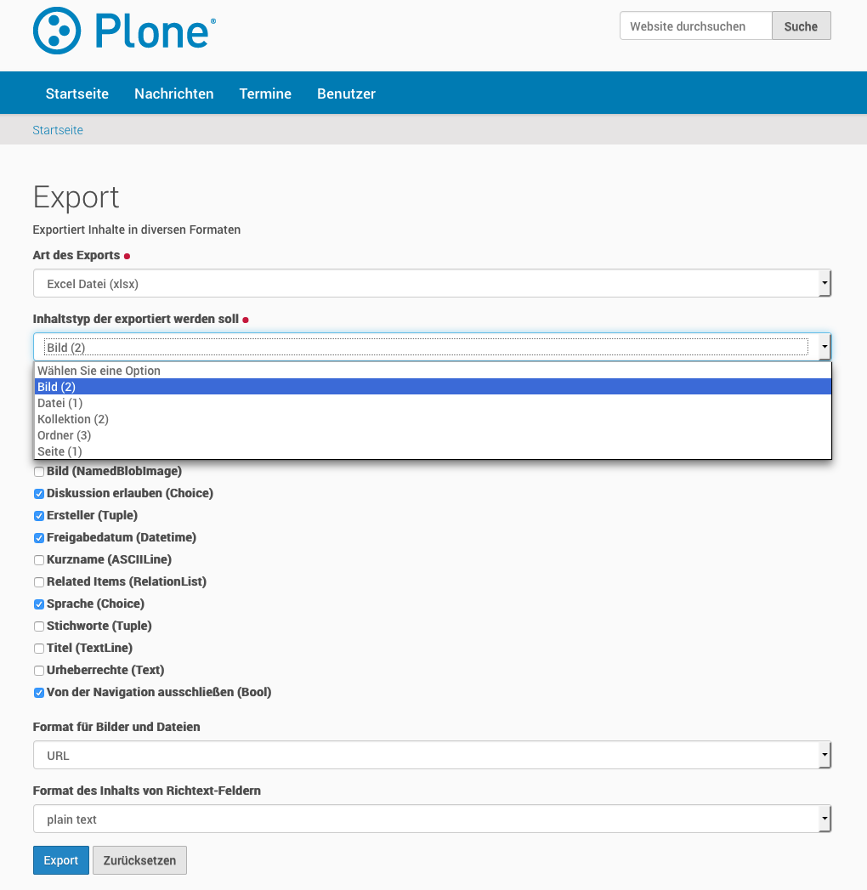

.. This README is meant for consumption by humans and pypi. Pypi can render rst files so please do not use Sphinx features.
   If you want to learn more about writing documentation, please check out: http://docs.plone.org/about/documentation_styleguide_addons.html
   This text does not appear on pypi or github. It is a comment.

.. image:: https://travis-ci.org/collective/collective.contentexport.svg?branch=master
    :target: https://travis-ci.org/collective/collective.contentexport

.. image:: https://coveralls.io/repos/collective/collective.contentexport/badge.svg?branch=master&service=github
    :target: https://coveralls.io/github/collective/collective.contentexport?branch=master

.. image:: https://img.shields.io/pypi/v/collective.contentexport.svg
    :target: https://pypi.python.org/pypi/collective.contentexport

.. image:: https://img.shields.io/pypi/l/collective.contentexport.svg

==============================================================================
collective.contentexport
==============================================================================

Features
--------

Exports dexterity content in various formats:

- xlsx
- xls
- csv
- tsv
- json
- yaml
- html (a table)
- zip-file containing all images from image-fields
- zip-file containing all files from file-fields
- zip-file containing related files and images from relationfields

It can be used to export all instances of a dexterity type and all its data. It cannot be used to export a folder-structure of content.

Usage
-----

Provides a form ``/@@collective_contentexport_view`` to configure the export.

The form allows you to:

- Select the export type
- Select the content type to export
- Choose fields from the selected type to be ignored
- Select the format of richtext-fields (html/plaintext)
- Select the format for files and images (url, base64, location within zip-file)

collective.contentexport uses `tablib <https://pypi.python.org/pypi/tablib>`_ for several export-formats.

Use in code
-----------

You can use the ``collective_contentexport_view`` in code to have more control over the results.

The view ``collective_contentexport_view`` accepts the following parameters:

export_type
    The export-format you want to use. Accepts the following options:

    - xlsx (Excel Spreadsheet (xlsx))
    - xls (Excel Legacy Spreadsheet (xls))
    - yaml (YAML)
    - html (HTML Table)
    - csv (Comma Separated Values File)
    - tsv (Tab Separated Values File)
    - json (JSON Dump)
    - images (Export images as zip)
    - files (Export files as zip)
    - related (Export related files and images as zip)

portal_type
    The content-type you want to export

blob_format
    The format in which blobs (filed/images) should be exported. Accepts the following options:

    - url (URL)
    - base64 (Base64-encoded string)
    - zip_path (Location within the a zip)

richtext_format
    The format in which richtext (html) should be exported. Options:

    - html
    - text/plain

blacklist
    Fields that should be ommited from the export (cannot be combined with whitelist).

whitelist
    Only these fields should be included in the export (cannot be combined with blacklist).

additional
    Additional data to export. A dict with a name (for the heading) as key and a callable method as value to get additional data for the export from the objects.

query
    Catalog-query to filter the exported content.

The following example creates a zip-file with images or files from the field ``primary_picture`` for the type ``some_type``:

..  code-block:: python

    view = api.content.get_view('collective_contentexport_view', portal, request)
    view(export_type='related', portal_type='some_type', whitelist='primary_picture')

You can filter the items that should be exported by passing a catalog-query:

..  code-block:: python

    path = '/'.join(self.context.getPhysicalPath())
    view = api.content.get_view('collective_contentexport_view', portal, request)
    view(export_type='json', portal_type='Document', query={'review_state': 'published', 'path': path})

You can also extend the export.
In the following example the value ``some_fieldname`` is being extracted from the object using the method ``_somehandler``.

..  code-block:: python

    def _somehandler(obj):
        return some_crazy_transform(obj.custom_field)

    additional = {'some_fieldname': _somehandler}
    view = api.content.get_view('collective_contentexport_view', portal, request)
    result = view(export_type='json', portal_type='Document', additional=additional)

You can also override the default methods to modify the default behavior.
In the following example the ``image`` from Images is being extracted using the method ``_get_imagename`` that only dumps the filename of the image:

..  code-block:: python

    def _get_imagename(obj):
        if obj.image:
            return obj.image.filename

    additional = {'image': _get_imagename}
    view = api.content.get_view('collective_contentexport_view', portal, request)
    result = view(export_type='json', portal_type='Image', additional=additional)

Compatability
-------------

collective.contentexport is tested to work in Plone 4 and Plone 5.

Installation
------------

Install collective.contentexport by adding it to your buildout::

    [buildout]

    ...

    eggs =
        collective.contentexport

and then running ``bin/buildout``.

You don't need to install the add-on to use the export.

Contribute
----------

- Issue Tracker: https://github.com/collective/collective.contentexport/issues
- Source Code: https://github.com/collective/collective.contentexport

Support
-------

If you are having issues, please let us know at https://github.com/collective/collective.contentexport/issues.

License
-------

The project is licensed under the GPLv2.
